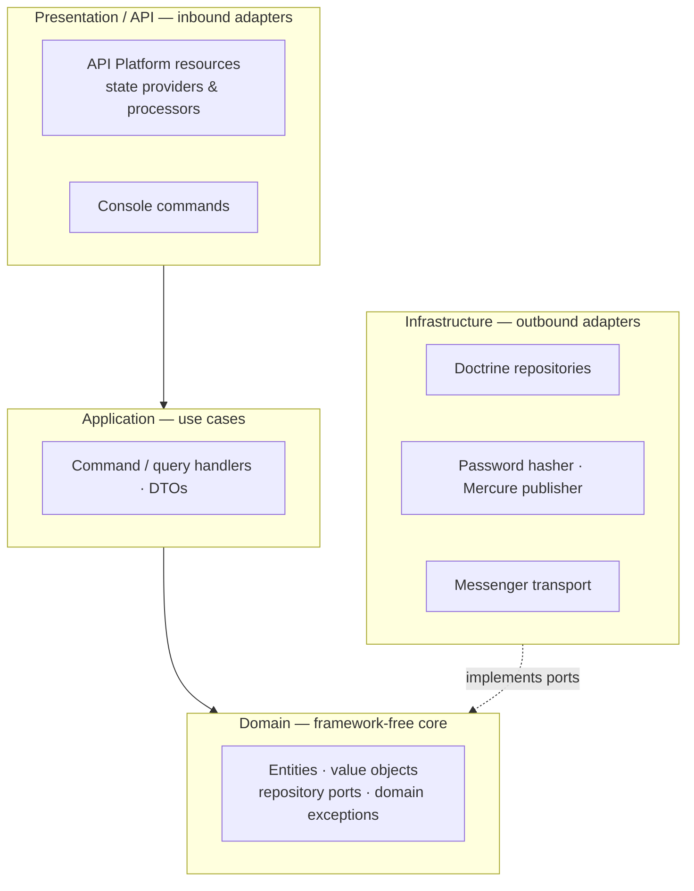
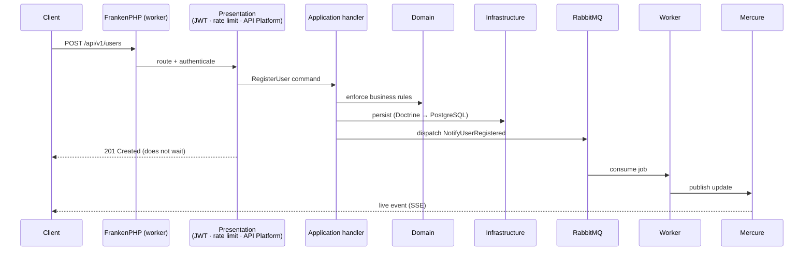

# skeleton-api-project-symfony

A reusable backend API skeleton built on **PHP 8.4 · Symfony 8.1 · API Platform 4.3 · PostgreSQL 18.4**, designed as a starting point for sophisticated mobile and web application backends. It ships the essentials you almost always need — layered architecture, JWT auth with refresh tokens, async processing, real-time updates, caching, structured logging, health checks, a test suite, and CI — already wired and documented.

<!-- Replace <you> with your GitHub org/user once pushed: -->
<!--  -->

---

## Stack

| Layer | Technology | Version |
|---|---|---|
| Language | PHP | 8.4 |
| Framework | Symfony | 8.1 |
| API | API Platform | 4.3 |
| Database | PostgreSQL | 18.4 |
| App runtime / web server | FrankenPHP (Caddy, worker mode, built-in Mercure hub) | 1.x |
| ORM | Doctrine ORM / DBAL | 3.x / 4.x |
| Cache / sessions / locks | Valkey (Redis-compatible) | 8.x |
| Async / heavy tasks | Symfony Messenger → RabbitMQ (AMQP) | — |
| Real-time | Mercure (inside FrankenPHP) | — |
| Auth | Lexik JWT + gesdinet refresh tokens | 3.x / — |
| Identifiers | UUIDv7 (`symfony/uid`) | — |
| Logging | Monolog (structured JSON in prod) | 3.x |
| Tests | PHPUnit + API Platform `ApiTestCase` + `dama/doctrine-test-bundle` | 13.x |
| Static analysis | PHPStan (level **max**) | 2.x |
| Code style | PHP-CS-Fixer (`@PER-CS` + `@Symfony`) | 3.x |

> **Note on Symfony 8.1:** this is a *standard* release (support ends January 2027), not LTS. The current LTS is 7.4. The skeleton pins 8.1 deliberately; plan for the ~6-month upgrade cadence (8.2, 8.3, …).

---

## Architecture

A lightweight hexagonal / layered design. The **Domain** core knows nothing about Symfony, Doctrine, or HTTP; every dependency points inward toward it. Presentation and Infrastructure are both *adapters* — one drives the app from the outside (HTTP in), the other is driven by it (DB, cache, queue out).



### Request lifecycle

A write request stays synchronous (the client gets an instant response), but can hand heavy work to the queue and push live updates over Mercure:



The four layers:

- **Domain** — pure PHP: entities, value objects (e.g. `Email`), repository interfaces (ports), domain exceptions. Survives a framework rewrite.
- **Application** — use cases orchestrating the domain; immutable command DTOs and their handlers.
- **Infrastructure** — adapters implementing the domain ports: Doctrine repositories, the Symfony-backed password hasher, the Mercure publisher, Messenger transports.
- **Presentation** — API Platform resources with state providers/processors, console commands, the security entry points, health checks.

The skeleton ships one fully wired bounded context — **`User`** — through every layer, as a reference to copy when adding new contexts.

---

## Project structure

```
.
├── Dockerfile                     # multi-stage FrankenPHP (dev + prod), PHP 8.4
├── compose.yaml                   # php, database, cache, rabbitmq, worker
├── compose.override.yaml          # dev (auto-loaded)
├── compose.prod.yaml              # prod (loaded explicitly)
├── Makefile                       # make up / test / stan / cs-fix …
├── frankenphp/                    # Caddyfile, entrypoint, php ini configs
├── config/                        # framework, doctrine, security, messenger, …
├── migrations/                    # Doctrine migrations (versioned schema)
├── src/
│   ├── Shared/
│   │   ├── Domain/                # AbstractEntity (UUIDv7 base), DomainException
│   │   ├── Infrastructure/        # correlation-id (logging, http, messenger), rate limiter
│   │   └── Presentation/Http/     # health checks
│   └── User/                      # example bounded context
│       ├── Domain/                # User, Email, ports, exceptions
│       ├── Application/           # RegisterUser use case, async notification message
│       ├── Infrastructure/        # Doctrine repo, password hasher, notification handler
│       └── Presentation/
│           ├── Api/               # UserResource, state providers/processors, auth routes
│           └── Cli/               # register-user command
└── tests/
    ├── Unit/                      # fast, no kernel
    ├── Integration/               # real test DB, transactional rollback
    └── Api/                       # full HTTP via ApiTestCase
```

---

## Features

- **API** — REST + OpenAPI/Swagger UI, JSON-LD and JSON formats, URI versioning (`/api/v1`, per-resource so versions can coexist).
- **Auth** — JWT access tokens (15 min) + rotating refresh tokens (30 days), stateless firewall over `/api/v1`.
- **Async / heavy tasks** — Symfony Messenger over RabbitMQ, a dedicated worker container, retry strategy + dead-letter queue.
- **Real-time** — Mercure hub built into FrankenPHP; the worker publishes live updates over SSE.
- **Caching** — Valkey-backed app cache (rate limiter, Doctrine prod caches).
- **Errors** — RFC 7807 `application/problem+json`; domain exceptions mapped to HTTP status via `exception_to_status`.
- **Hardening** — per-IP rate limiting, CORS, security headers.
- **Observability** — structured JSON logs in prod, a correlation ID threaded across the web request *and* the worker (one ID per request, even across the queue), `/health` (liveness) and `/health/ready` (readiness).
- **Quality** — PHPUnit (unit/integration/API), PHPStan at level max, PHP-CS-Fixer, GitHub Actions CI.

---

## Getting started

**Prerequisites:** Docker + Docker Compose. (Local PHP 8.4 is only needed if you scaffold outside the container.)

```bash
make up                       # build & start php, database, cache, rabbitmq
make worker                   # start the Messenger worker
```

Then:

- API docs (Swagger UI): <https://localhost/api> — accept the self-signed cert
- OpenAPI spec: <https://localhost/api/docs.json>
- RabbitMQ management: <http://localhost:15672> (default `app` / `!ChangeMe!`)
- Health: <https://localhost/health> and <https://localhost/health/ready>

First-run auth setup (JWT signing keys; `config/jwt/` is gitignored):

```bash
docker compose exec php php bin/console lexik:jwt:generate-keypair
```

### Make targets

| Target | Description |
|---|---|
| `make up` | Build & start the dev stack (waits for healthchecks) |
| `make down` | Stop and remove the stack |
| `make worker` | Start the Messenger worker |
| `make sh` | Shell into the php container |
| `make logs` | Tail all logs |
| `make test` | Run the full test suite |
| `make stan` | Static analysis (PHPStan, level max) |
| `make cs-fix` | Auto-fix code style |
| `make cs-check` | Check code style without modifying files |

---

## Database migrations

Schema changes are managed with Doctrine Migrations (versioned PHP classes in `migrations/`). The workflow is **change an entity → generate a migration → review it → apply it** — never edit the database by hand.

> On container start the entrypoint auto-applies any pending migrations once `DATABASE_URL` is set in `.env`, so `make up` keeps your dev database current. The commands below are for authoring and for explicit control.

### Generate a migration

After adding or changing a mapped entity, diff the entities against the current schema:

```bash
docker compose exec php php bin/console doctrine:migrations:diff
```

This writes a new `migrations/VersionYYYYMMDDHHMMSS.php`. **Always open and review it** before applying — Doctrine's diff is usually right but not infallible, and some changes need hand-editing (see the evolving-schema note below).

### Apply migrations

```bash
docker compose exec php php bin/console doctrine:migrations:migrate --no-interaction
```

### Inspect

```bash
docker compose exec php php bin/console doctrine:migrations:status   # current version, how many pending
docker compose exec php php bin/console doctrine:migrations:list     # every migration and its state
```

### Roll back

```bash
docker compose exec php php bin/console doctrine:migrations:migrate prev --no-interaction   # undo the last migration
```

(Each migration's `down()` defines its rollback. Avoid rolling back in production unless the `down()` is genuinely safe — prefer a new forward migration.)

### Test database

The `test` environment uses a separate `app_test` database. Create and migrate it once (and after adding migrations):

```bash
docker compose exec php php bin/console doctrine:database:create --if-not-exists --env=test
docker compose exec php php bin/console doctrine:migrations:migrate --no-interaction --env=test
```

### Evolving a populated table

Adding a `NOT NULL` column to a table that already has rows will fail. Hand-edit the generated migration to add it nullable, backfill, then enforce the constraint — all in one `up()`:

```php
$this->addSql('ALTER TABLE users ADD password_hash VARCHAR(255) DEFAULT NULL');
$this->addSql("UPDATE users SET password_hash = '!' WHERE password_hash IS NULL");
$this->addSql('ALTER TABLE users ALTER password_hash SET NOT NULL');
```

---

## Environment variables

Defaults live in `compose.yaml`; override per environment in `.env.local` (dev) or real secrets management (prod). **Change every `!ChangeMe!` and the Mercure/JWT secrets before any non-local deployment.**

| Variable | Purpose |
|---|---|
| `SERVER_NAME` | Hostname Caddy serves (default `localhost`) |
| `HTTP_PORT` / `HTTPS_PORT` | Host ports (default 80 / 443) |
| `POSTGRES_DB` / `POSTGRES_USER` / `POSTGRES_PASSWORD` | Database credentials |
| `DATABASE_URL` | Doctrine DSN (`serverVersion=18.4`) |
| `REDIS_URL` | Valkey connection (`redis://cache:6379`) |
| `RABBITMQ_USER` / `RABBITMQ_PASSWORD` | Broker credentials |
| `MESSENGER_TRANSPORT_DSN` | AMQP transport |
| `MERCURE_*` | Hub URLs + JWT secret |
| `JWT_SECRET_KEY` / `JWT_PUBLIC_KEY` / `JWT_PASSPHRASE` | Lexik signing keys |
| `CORS_ALLOW_ORIGIN` | Allowed origins regex |
| `APP_ENV` / `APP_SECRET` | Symfony environment & secret |

---

## API usage

```bash
# Register (public)
curl -ks -X POST https://localhost/api/v1/users \
  -H 'Content-Type: application/json' \
  -d '{"email":"user@example.com","password":"sup3rsecret"}'

# Log in -> { "token": "...", "refresh_token": "..." }
curl -ks -X POST https://localhost/api/v1/auth \
  -H 'Content-Type: application/json' \
  -d '{"email":"user@example.com","password":"sup3rsecret"}'

# Authenticated request
curl -ks https://localhost/api/v1/me -H "Authorization: Bearer <token>"

# Refresh the access token (single-use rotation)
curl -ks -X POST https://localhost/api/v1/token/refresh \
  -H 'Content-Type: application/json' \
  -d '{"refresh_token":"<refresh_token>"}'

# Subscribe to real-time updates
curl -ks -N "https://localhost/.well-known/mercure?topic=users"
```

---

## Testing & quality

```bash
# one-time: create + migrate the test database
docker compose exec php php bin/console doctrine:database:create --if-not-exists --env=test
docker compose exec php php bin/console doctrine:migrations:migrate --no-interaction --env=test

make test        # PHPUnit: unit + integration (transactional rollback) + API
make stan        # PHPStan, level max
make cs-check    # code style
```

CI (`.github/workflows/ci.yaml`) runs all three gates — style → analysis → tests — against real PostgreSQL 18.4 and RabbitMQ service containers on every push and pull request.

---

## Design decisions & trade-offs

This skeleton favors pragmatism over architectural purity in a few places. Each is a conscious choice, documented so you can tighten it if your project warrants:

1. **Domain entities carry ORM attributes.** `User` is annotated with Doctrine mapping rather than using separate XML/PHP mapping. Keeps things simple; the cost is that the domain isn't 100% framework-free. To purify: move mapping to `config/` and keep entities annotation-less.

2. **`User` implements Symfony's `UserInterface` / `PasswordAuthenticatedUserInterface`.** Lets us use the built-in `entity` user provider — robust and well-trodden. The stricter alternative is a `SecurityUser` adapter in Infrastructure plus a custom user provider, keeping the domain entity free of security contracts.

3. **The application handler injects `MessageBusInterface` directly.** `RegisterUserHandler` dispatches the async message itself. A stricter design hides this behind an `EventBus` port so the application layer depends only on its own abstraction.

4. **Domain exception messages are part of the API contract.** `exception_to_status` maps domain exceptions to HTTP status codes and surfaces their messages as RFC 7807 `detail`. **Rule:** keep domain exception messages safe to expose to clients. If untrusted messages might appear, switch to curated API Platform `ErrorResource` mappings instead.

5. **Per-resource URI versioning.** Each resource sets `routePrefix: '/v1'`, so a future `UserResourceV2` can carry `/v2` and both coexist. The `/api` entrypoint and docs stay unversioned.

6. **Password hashing stays clean.** Despite (2), hashing goes through a `PasswordHasher` domain port implemented by `SymfonyPasswordHasher` in Infrastructure — the application never imports Symfony's hasher.

---

## Production notes

- **Prune expired refresh tokens** on a cron: `php bin/console gesdinet:jwt:clear`.
- **JWT keys** are environment-specific and gitignored — generate them per environment; never commit them.
- The **prod image** (`compose.prod.yaml`, `frankenphp_prod` target) runs as a non-root user. An even leaner distroless variant is available in the upstream Symfony Docker template if image size matters.
- The Messenger **`failed` (dead-letter) transport** auto-creates its `messenger_messages` table on first use. For production you may prefer `auto_setup: false` plus an explicit migration.
- Logs are emitted as **structured JSON to stderr in prod** — point your aggregator at the container's stderr; each line carries `extra.correlation_id`.

---

## License

Proprietary — adjust to your needs.
